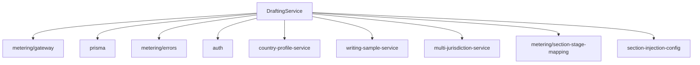

# DEPENDENCY MAPPING ANALYSIS
## Phase 0 Task 0.2 - Drafting Service Dependency Graph

**Date:** December 28, 2025
**Primary Service:** `src/lib/drafting-service.ts`

---

## DEPENDENCY GRAPH

### 🔵 CORE SERVICE: DraftingService
**Location:** `src/lib/drafting-service.ts`

#### DIRECT IMPORTS (9 dependencies):


#### DEPENDENCY DETAILS:

| Dependency | Purpose | Import Type | Risk Level |
|------------|---------|-------------|------------|
| `metering/gateway` | LLM API calls, patent drafting execution | Core functionality | 🔴 HIGH |
| `prisma` | Database operations | Core functionality | 🔴 HIGH |
| `metering/errors` | Error handling | Utility | 🟢 LOW |
| `auth` | JWT verification | Security | 🟡 MEDIUM |
| `country-profile-service` | Jurisdiction-specific prompts & rules | Business logic | 🔴 HIGH |
| `writing-sample-service` | Writing style samples | Enhancement | 🟡 MEDIUM |
| `multi-jurisdiction-service` | Section requirements, jurisdiction logic | Business logic | 🔴 HIGH |
| `metering/section-stage-mapping` | Section categorization | Utility | 🟡 MEDIUM |
| `section-injection-config` | Prompt building utilities | Business logic | 🔴 HIGH |

---

## DOWNSTREAM DEPENDENCIES

### API Routes Using DraftingService:
```mermaid
graph TD
    DS[DraftingService]
    DS --> AR1[api/patents/[patentId]/drafting/route.ts]
    DS --> AR2[api/patents/[patentId]/draft/route.ts]

    AR1 --> CP[country-profile-service]
    AR1 --> WS[writing-sample-service]
    AR1 --> MJ[multi-jurisdiction-service]
    AR1 --> MG[metering/gateway]
    AR1 --> IB[idea-bank-service]
    AR1 --> IF[idea-bank-funnel]
    AR1 --> SA[section-alias-service]
    AR1 --> SM[service-access-middleware]
    AR1 --> JS[jurisdiction-style-service]
    AR1 --> PT[patent-drafting-tracker]
    AR1 --> JSS[jurisdiction-state-service]
    AR1 --> UI[user-instruction-service]
    AR1 --> AN[annexure-schema]
    AR1 --> FS[figure-sequence]
    AR1 --> AIR[ai-review-service]
```

#### Key API Route Dependencies:
- **Direct imports**: 20+ services/utilities beyond DraftingService
- **Shared dependencies**: Many services imported by both DraftingService and API routes
- **Business logic coupling**: Heavy dependency on jurisdiction and country-specific services

---

## DATA FLOW ANALYSIS

### Complete Request Flow:
```
UI Component → API Route → DraftingService → Multiple Services → Database
```

#### 1. UI Layer (Patent Drafting Components)
- `IdeaEntryStage.tsx` - User input for invention
- `RelatedArtStage.tsx` - Prior art analysis
- `ClaimRefinementStage.tsx` - Patent claims
- `AnnexureDraftStage.tsx` - Section drafting
- `ExportCenterStage.tsx` - Document generation

#### 2. API Routes (2 main endpoints)
- `/api/patents/[patentId]/drafting/route.ts` - Section generation, validation
- `/api/patents/[patentId]/draft/route.ts` - Full drafting execution

#### 3. Core Service Layer (DraftingService)
**Key Methods:**
- `executeDrafting()` - Full patent drafting workflow
- `normalizeIdea()` - Invention analysis and structuring
- `generateSections()` - Individual section generation
- `generateAnnexureDraft()` - Complete patent document

#### 4. Supporting Services (8 direct dependencies)
- **Country/Jurisdiction**: Rules, prompts, formatting
- **Writing Samples**: Style consistency
- **Metering**: Usage tracking, LLM calls
- **Section Logic**: Requirements, validation

#### 5. Database Layer
- **Patent** table - Main entity
- **AnnexureDraft** table - Draft content
- **IdeaRecord** table - Normalized invention data
- **CountryProfile** tables - Jurisdiction rules
- **SupersetSection** tables - Base prompts

---

## CIRCULAR DEPENDENCY ANALYSIS

### ✅ NO CIRCULAR DEPENDENCIES FOUND

**Analysis Results:**
- DraftingService imports from 9 services
- None of those services import DraftingService back
- API routes import both DraftingService AND its dependencies directly
- Clean hierarchical structure maintained

**Dependency Direction:**
```
API Routes → DraftingService → Supporting Services → Database
                    ↓
             Direct API access to supporting services
```

---

## REFACTORING RISK ASSESSMENT

### 🔴 HIGH RISK AREAS:

#### 1. Country/Jurisdiction Dependencies
- **Impact**: Core business logic tightly coupled to patent jurisdiction system
- **Refactoring**: Replace with publication venue system for academic papers
- **Files**: `country-profile-service.ts`, `multi-jurisdiction-service.ts`

#### 2. LLM Integration
- **Impact**: Patent-specific prompts and workflows
- **Refactoring**: Convert to citation-aware academic writing prompts
- **Files**: `metering/gateway.ts`, `section-injection-config.ts`

#### 3. Database Schema Coupling
- **Impact**: Direct table dependencies (Patent, AnnexureDraft)
- **Refactoring**: Rename tables, change relationships
- **Files**: Prisma schema, all database operations

### 🟡 MEDIUM RISK AREAS:

#### 1. API Route Complexity
- **Impact**: Large monolithic API routes with multiple responsibilities
- **Refactoring**: Break into smaller, focused endpoints
- **Files**: `route.ts` files (10,000+ lines each)

#### 2. Service Interface Changes
- **Impact**: Method signatures expect patent-specific parameters
- **Refactoring**: Update interfaces for paper writing context
- **Files**: All service method signatures

### 🟢 LOW RISK AREAS:

#### 1. Infrastructure Services
- **Impact**: Auth, metering, error handling are generic
- **Refactoring**: Minimal changes needed
- **Files**: `auth.ts`, `metering/errors.ts`

#### 2. Utility Functions
- **Impact**: Pure functions, easy to adapt
- **Refactoring**: Update parameter names and contexts
- **Files**: Pure utility functions

---

## MIGRATION STRATEGY

### Phase 1: Database Schema (Foundation)
1. Rename tables: `Patent` → `Paper`, `AnnexureDraft` → `SectionDraft`
2. Add new tables: `PaperTypeDefinition`, `CitationStyleDefinition`
3. Update foreign keys and relationships

### Phase 2: Core Services (Parallel Development)
1. Create new `PaperDraftingService` alongside existing `DraftingService`
2. Implement feature flags to switch between patent/paper modes
3. Gradually migrate API routes to use new service

### Phase 3: API Routes (Incremental)
1. Create new `/api/papers/` routes
2. Maintain old `/api/patents/` routes during transition
3. Update UI components to use new endpoints

### Phase 4: UI Components (Final)
1. Replace patent-specific components with paper components
2. Update stage navigation and workflows
3. Remove old patent components

---

## RECOMMENDED IMPLEMENTATION ORDER

### Immediate (Phase 1):
1. ✅ Database schema changes
2. ✅ Feature flag system
3. ✅ New service skeleton (interfaces only)

### Week 1-2 (Phase 2):
1. Core service implementation
2. Basic API routes
3. Simple UI components

### Week 3-4 (Phase 3):
1. Advanced features (citations, literature search)
2. Complex UI components
3. Testing and validation

### Week 5 (Phase 4):
1. Full migration
2. Old system removal
3. Documentation update

---

## DEPENDENCY ISOLATION RECOMMENDATIONS

### 1. Extract Interfaces
```typescript
// Current: Tight coupling
import { DraftingService } from './drafting-service'

// Recommended: Interface-based
interface IPaperDraftingService {
  executeDrafting(params: PaperDraftingParams): Promise<DraftingResult>
  normalizeIdea(idea: ResearchIdea): Promise<NormalizedIdea>
}
```

### 2. Dependency Injection
```typescript
// Current: Direct imports
const countryProfile = await getCountryProfile(jurisdiction)

// Recommended: Injected dependencies
constructor(
  private countryService: ICountryProfileService,
  private citationService: ICitationService
) {}
```

### 3. Feature Flags for Gradual Migration
```typescript
if (ENABLE_PAPER_WRITING) {
  return paperDraftingService.execute(params)
} else {
  return patentDraftingService.execute(params)
}
```

This dependency analysis provides a clear roadmap for refactoring the patent drafting system into a research paper writing application while minimizing risks and maintaining system stability.
