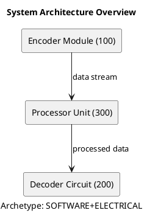

# Patent Drafting Process - Complete Technical Overview

## System Architecture Overview

This is a sophisticated multi-jurisdiction patent drafting system that transforms raw invention data into compliant patent specifications across different countries. The system uses a hierarchical prompt architecture, archetype-based intelligence, and LLM-powered content generation.

---

## 1. INPUT DATA SOURCES

### Primary Input: Invention Record
```json
{
  "title": "Wireless Video Compression System",
  "problem": "Existing video compression causes quality loss at high bitrates",
  "objectives": ["Reduce bandwidth usage", "Maintain video quality"],
  "components": [
    {"name": "Encoder Module", "numeral": 100},
    {"name": "Decoder Circuit", "numeral": 200}
  ],
  "logic": "The system uses adaptive quantization based on content analysis",
  "fieldOfRelevance": ["Computer Science", "Signal Processing"],
  "inventionType": ["SOFTWARE", "ELECTRICAL"]
}
```

### Secondary Inputs:
- **Country Profiles**: Jurisdiction-specific rules (IN.json, US.json, etc.)
- **Writing Samples**: Style examples from existing patents
- **User Instructions**: Custom drafting preferences
- **Prior Art**: Referenced patents for background sections
- **Reference Drafts**: Previously drafted specifications

---

## 2. DATA NORMALIZATION & ENRICHMENT

### Step 2.1: Idea Record Processing
**Input**: Raw invention data from user input
**Process**: `normalizeIdeaRecord()` function
**Output**: Structured, cleaned data with:
- Standardized component numbering
- Extracted keywords and classifications
- Invention archetype detection (MECHANICAL/SOFTWARE/CHEMICAL/ELECTRICAL/BIO)
- IPC/CPC code suggestions
- Technical field classification

**Key Data Transformations:**
```javascript
// Raw input → Normalized structure
{
  title: "wireless video compression system",
  normalizedData: {
    inventionType: ["SOFTWARE", "ELECTRICAL"],
    components: [{name: "Encoder Module", numeral: 100}],
    keywords: ["compression", "wireless", "video"],
    technicalField: "Data processing"
  }
}
```

### Step 2.2: Archetype Intelligence
**Algorithm**: Pattern matching against invention components and description
```javascript
// Archetype detection logic
if (/(software|algorithm|logic|data|processing)/.test(description)) return 'SOFTWARE'
if (/(mechanic|device|apparatus|tool)/.test(description)) return 'MECHANICAL'
if (/(chemical|compound|formulation|substance)/.test(description)) return 'CHEMICAL'
```

**Purpose**: Provides domain-specific drafting protocols and mental models

---

## 3. PROMPT ARCHITECTURE & MERGING

### Hierarchical Prompt Structure
```
┌─────────────────────────────────────────────────────────────────────────────┐
│  INSTRUCTION PRIORITY HIERARCHY (follow in case of conflicts)               │
├─────────────────────────────────────────────────────────────────────────────┤
│  Priority 1 (LOWEST):  BASE PROMPT - Universal patent drafting guidelines   │
│  Priority 2 (MEDIUM):  COUNTRY TOP-UP - [IN] jurisdiction-specific rules    │
│  Priority 3 (HIGHEST): USER INSTRUCTIONS - Custom session instructions      │
└─────────────────────────────────────────────────────────────────────────────┘
```

### Step 3.1: Base Prompt Layer (SUPERSET_PROMPTS)
**Source**: `src/lib/drafting-service.ts`
**Content**: 17 universal patent sections with role-based instructions

Example for Title section:
```
**Role:** Formalities Officer (US/EP/PCT Compliance).
**Task:** Generate a strict, descriptive Title.
**Input Data:** {{ABSTRACT_OR_SUMMARY}}
**Drafting Logic (Chain-of-Thought):**
1. Analyze Subject: Is this a System, Method, Apparatus, or Composition?
2. Identify Core Function: What is the technical function...
```

### Step 3.2: Country-Specific Top-Up
**Source**: Country JSON files (Countries/IN.json, Countries/US.json)
**Process**: `getMergedPrompt()` in prompt-merger-service.ts
**Example for India**:
```json
"title": {
  "topUp": {
    "instruction": "For Indian jurisdiction under Rule 13(7)(a), ensure the title is specific, indicates the features of the invention, and is normally expressed in not more than 15 words.",
    "constraints": ["Avoid trademarks and personal names per Indian Patent Manual guidelines"]
  }
}
```

### Step 3.3: User Instructions
**Source**: Database (CountrySectionPrompt, UserInstruction tables)
**Priority**: HIGHEST - overrides base and country prompts
**Format**: Session-specific customizations

### Step 3.4: Archetype Protocol Integration
**Process**: `getArchetypeInstructions()` function
**Integration**: Added to main drafting prompt as "ARCHETYPE PROTOCOL"

Example for MECHANICAL archetype:
```
[MECHANICAL PROTOCOL]
For physical assemblies, consider this KINEMATIC CHAIN pattern:
1. Geometric Definition: Define shape, orientation, and connectivity
2. Force/Motion Transmission: Explain how movement/force flows between parts
3. Constraint Logic: Describe how degrees of freedom are restricted
```

---

## 4. JURISDICTION HANDLING

### Multi-Jurisdiction Architecture
**Core Concept**: Single invention → Multiple country-specific outputs

### Step 4.1: Country Profile Loading
**Source**: JSON files in `/Countries/` directory
**Content**:
- Section mappings (what sections apply to each country)
- Validation rules (word limits, requirements)
- Export configurations (fonts, margins, headings)
- Diagram preferences (paper size, color allowed)

### Step 4.2: Section Mapping Resolution
**Database**: `CountrySectionMapping` table
**Logic**: Maps universal sections to country-specific headings
```sql
-- Example mapping
countryCode: 'IN'
supersetCode: '01. Title'
sectionKey: 'title'
heading: 'Title of the Invention'
isRequired: true
```

### Step 4.3: Jurisdiction-Specific Rules
**Validation**: Word limits, required sections, formatting rules
**Export**: Document formatting, page layouts, section headings

---

## 5. LLM INTERACTION & DRAFTING

### Step 5.1: Prompt Construction
**Function**: `buildDraftingPrompt()` in DraftingService
**Components**:
1. **Style Rules**: Tone, voice, language, avoidances
2. **Archetype Protocol**: Domain-specific mental models
3. **Invention Context**: Title, problem, objectives, components
4. **Section Instructions**: Merged prompts for each section
5. **Reference Data**: Prior art, writing samples, reference drafts
6. **Validation Rules**: Country-specific constraints

### Step 5.2: LLM Call Structure
```javascript
const prompt = `You are drafting a ${jurisdiction} patent specification.
Apply these style rules:
Language: English
Tone: technical, neutral, precise
Voice: impersonal third person
Avoid: marketing language, unsupported advantages

ARCHETYPE PROTOCOL:
- Archetype: SOFTWARE+ELECTRICAL
[SOFTWARE PROTOCOL]
For algorithmic steps, consider this DATA-FLOW pattern...
[ELECTRICAL PROTOCOL]
For circuits, consider this SIGNAL-PATH pattern...

INVENTION CONTEXT:
Title: ${idea.title}
Problem: ${idea.problem}
Components: ${components.map(c => `${c.name} (${c.numeral})`).join(', ')}

// ... section-specific prompts and context
`
```

### Step 5.3: Section-by-Section Drafting
**Process**: LLM drafts each section individually
**Context Injection**: Previous sections, reference data, validation rules
**Output**: Section-specific text content

---

## 6. DIAGRAM GENERATION SUBSYSTEM

### Step 6.1: Figure Planning
**Input**: Invention components and relationships
**Process**: `generateSketch()` function
**Algorithm**:
1. **Component Analysis**: Classify components by type (processor, sensor, display, etc.)
2. **Relationship Mapping**: Determine connections between components
3. **Layout Optimization**: Position components for clarity

### Step 6.2: PlantUML Generation
**Input**: Component relationships and figure plan
**Process**: `generatePlantUML()` function
**Archetype Integration**: Diagrams tagged with invention archetype


### Step 6.3: Figure Sequence Management
**Algorithm**: `normalizeFigureSequence()` function
**Rules**:
- Figures numbered sequentially
- Reference numerals consistent across all figures
- Captions standardized format

---

## 7. OUTPUT GENERATION & FORMATTING

### Step 7.1: Section Assembly
**Process**: Combine drafted sections into complete specification
**Order**: Determined by country-specific section mappings
**Validation**: Check required sections, word limits, formatting

### Step 7.2: Document Export
**Configuration**: Per-country export settings from JSON profiles
**Formats**:
- **India**: A4, Times New Roman 12pt, 1.5 line spacing
- **US**: Letter, specific margin requirements
- **EP**: EPO formatting standards

### Step 7.3: Cross-Section Validation
**Rules**: Defined in country JSON validation.crossSectionChecks
**Examples**:
- Claims must be supported by detailed description
- Abstract must be consistent with claims
- Figures must be described in brief description section

---

## 8. QUALITY ASSURANCE & METRICS

### Step 8.1: LLM Metering
**Tracking**: Token usage, cost, response times
**Gates**: Usage limits, quality thresholds
**Analytics**: Performance metrics, error rates

### Step 8.2: Content Validation
**Automated Checks**:
- Word limits per section
- Required phrase inclusion
- Consistency between sections
- Claim support validation

### Step 8.3: User Feedback Loop
**Features**:
- Section-by-section editing
- Custom instruction addition
- Style preference learning
- Error reporting and correction

---

## 9. DATABASE SCHEMA & PERSISTENCE

### Core Tables:
- **IdeaRecord**: Normalized invention data
- **PatentSession**: Drafting sessions with jurisdiction state
- **SectionDraft**: Individual section content
- **CountrySectionMapping**: Jurisdiction-specific section rules
- **UserInstruction**: Custom drafting preferences
- **WritingSample**: Style learning examples

### Key Relationships:
```
PatentSession → SectionDraft (many-to-many)
PatentSession → UserInstruction (customizations)
IdeaRecord → normalizedData (archetype, components)
CountrySectionMapping → SupersetSection (universal sections)
```

---

## 10. SYSTEM INTEGRATION POINTS

### External Services:
- **LLM Gateway**: OpenAI/Anthropic API calls with metering
- **PlantUML Service**: Diagram rendering
- **Image Processing**: Figure validation and sizing
- **PDF Generation**: Document export formatting

### Internal Services:
- **Prompt Merger**: Combines base + country + user instructions
- **Jurisdiction State**: Tracks drafting progress across countries
- **Writing Sample**: Style learning and adaptation
- **Novelty Search**: Prior art integration

---

## Key Innovation Points

1. **Archetype Intelligence**: Domain-specific drafting protocols
2. **Hierarchical Prompting**: Base → Country → User instruction precedence
3. **Multi-Jurisdiction**: Single input → Multiple compliant outputs
4. **Context Injection**: Smart cross-section referencing
5. **Quality Gates**: Automated validation and improvement loops
6. **Adaptive Learning**: Writing sample incorporation and style evolution

This system transforms raw invention concepts into professionally drafted patent specifications while maintaining compliance with multiple international patent office requirements.
